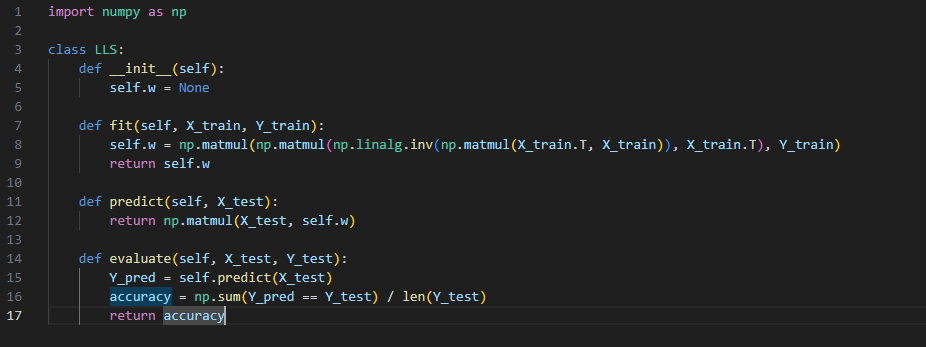
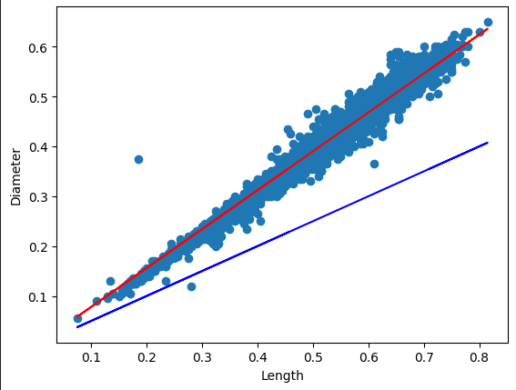
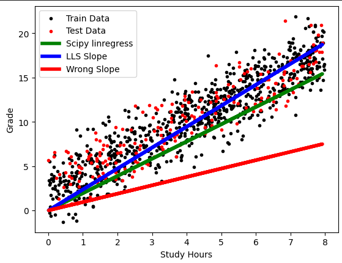
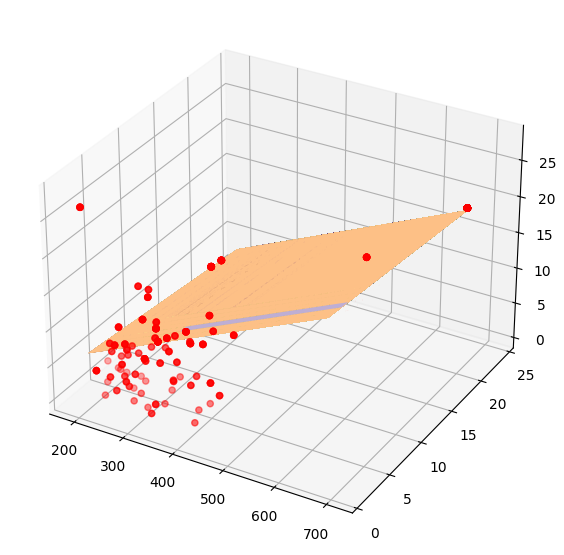

### In assignment no.44 we have write LLS library algorithm and use it in solving 2 projects.
---

# LLS algorithm

## abalone project

---
---

---
---
## Students Performance

---
---

## Boston House Prices

